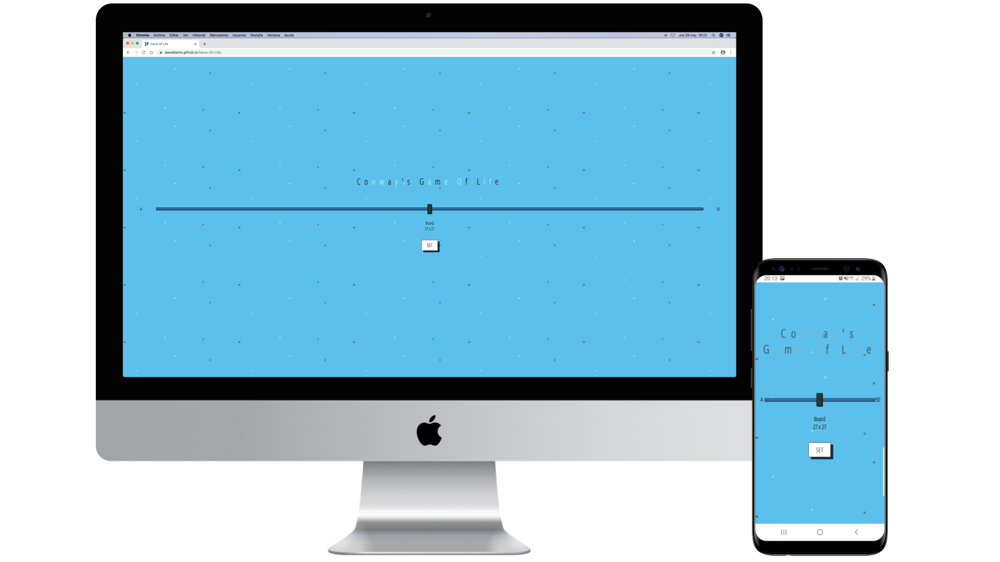
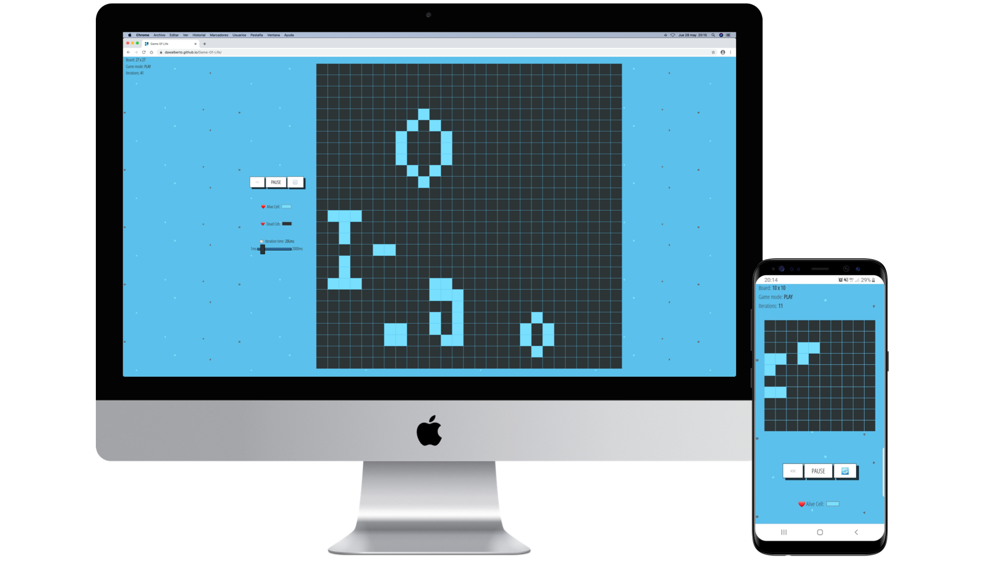

# [Conway's Game Of Life](https://dawalberto.github.io/Game-Of-Life/)
## Only with HTML, CSS and JavaScript

## Start Instructions
To start game simply do click on some cells to alive/dead them, when you get the initial pattern that wish click in play button. To reload board, back to previus iteration, change the alive/dead cell color or iteration time the game must be in PAUSE or CONFIGURE mode.

## Rules
* 💔 Any live cell with fewer than two live neighbours dies, as if by underpopulation.
* ❤️ Any live cell with two or three live neighbours lives on to the next generation.
* 💔 Any live cell with more than three live neighbours dies, as if by overpopulation.
* 😇 Any dead cell with exactly three live neighbours becomes a live cell, as if by reproduction.

### Set Board Screen

### Game Screen

